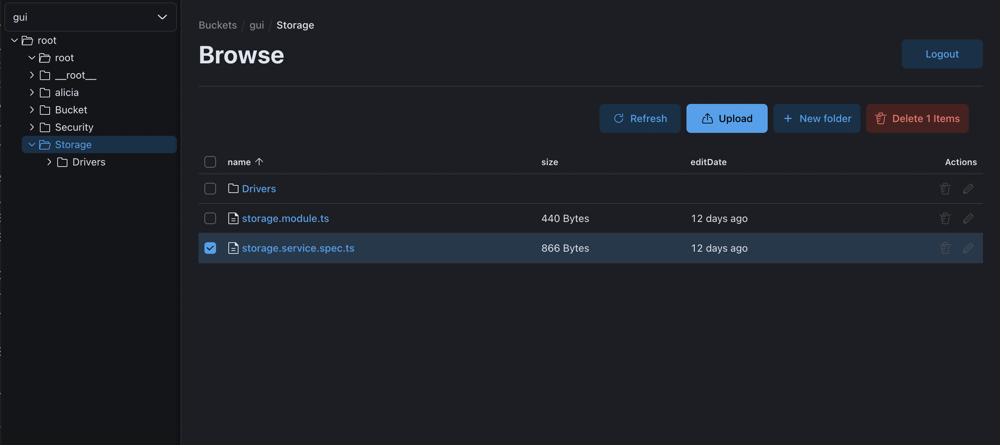

## Gui

The cool guy to browse S3 repositories!

### Features

* multi-buckets
    * multi hosts
    * multi auth methods (anonymous)

* browse / delete multi / upload multi
* light/dark theme (keep blue eyes beautiful)
* stream download for big files
* containerized with docker
* can be deployed on kubernetes with Helm

### Stack tech

* front with React / elastic EUI
* back with nestJS
* unit tests with jest
* E2E tests (todo)

### Contribute

Read [CONTRIBUTING.md](CONTRIBUTING.md) guide, 
and [docs/dev/getting-started.md](docs/dev/getting-started.md).